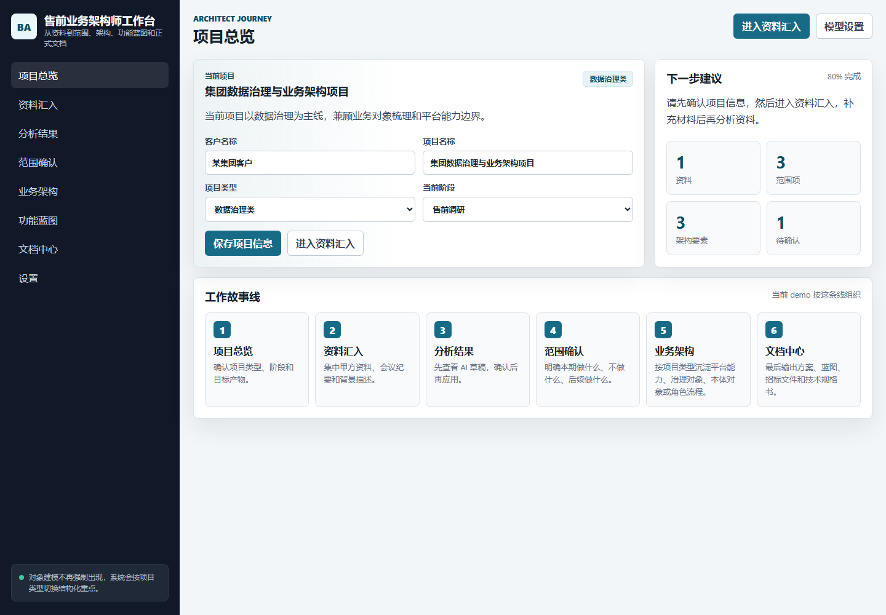
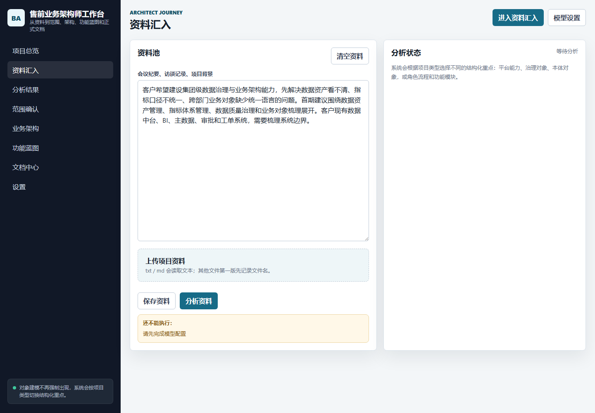
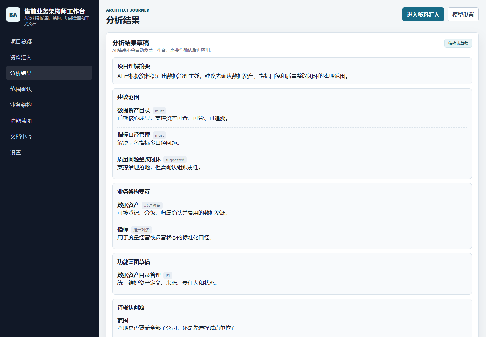
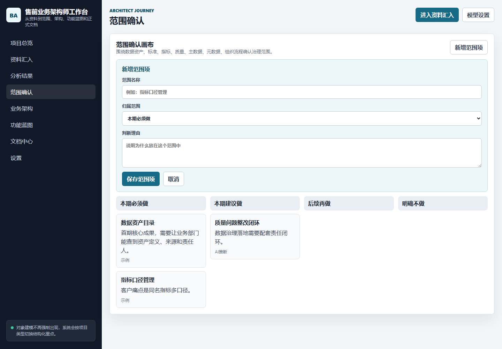
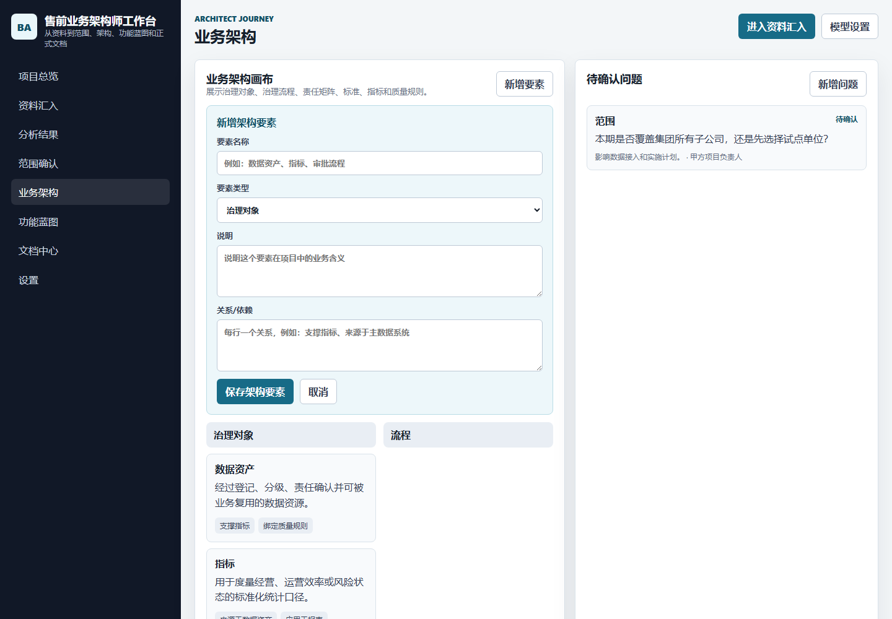
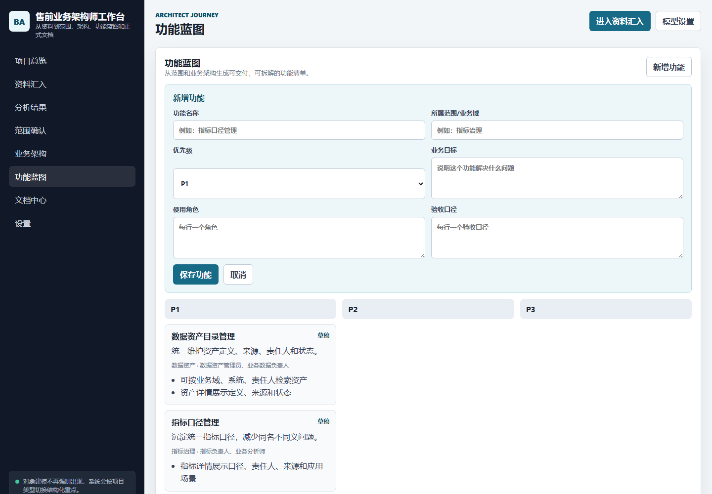
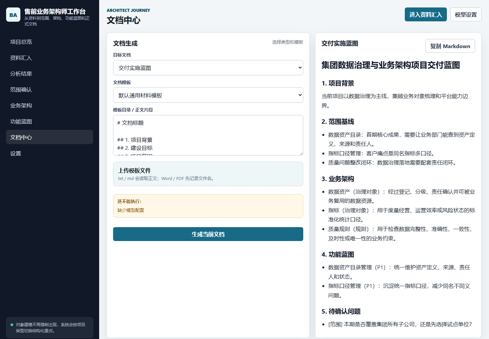

# Presales Architect Workbench

> Turn scattered client conversations into delivery-ready project materials.

**Presales Architect Workbench** is a bilingual workspace for presales business architects. It helps you collect client inputs, clarify project scope, model the right business architecture, shape a feature blueprint, and generate documents that delivery teams can actually use.

中文名：**售前业务架构师工作台**



## Why This Exists

In many ToB projects, the hardest part is not writing code. The hard part is translating incomplete client input into something a delivery team can implement:

- What is in scope, what is out of scope, and what is still uncertain?
- Which business objects, governance objects, systems, roles and processes matter?
- Which requirements are confirmed facts, and which are only assumptions?
- How do we turn meeting notes into a technical specification, tender document or delivery blueprint?

This workbench is designed for that messy presales middle layer. It is not a simple questionnaire, and it is not just a document generator. It is a structured thinking tool for architects.

## The Product Story

Imagine you just finished a client workshop.

You have meeting notes, screenshots, partial documents, business pain points, and a few unclear expectations. Instead of writing a long document from scratch, you open the workbench and move through one story:

1. **Create the project**  
   Select whether it is a big data platform, data governance, ontology modeling, custom software, or a hybrid project.

2. **Import the materials**  
   Paste meeting notes or upload files. The tool waits for your input and will not start analysis before the materials are ready.

3. **Run AI analysis**  
   Configure Kimi, GLM, DeepSeek, MiniMax, Qwen, Doubao, OpenAI, OpenRouter or another OpenAI-compatible model.

4. **Review the draft**  
   AI output first lands in a review page. You decide whether to apply it to the workspace.

5. **Shape the architecture**  
   Edit scope, architecture elements, open questions and feature blueprint manually.

6. **Generate formal documents**  
   Export tender drafts, technical specifications, project statements, delivery blueprints and development briefs.



## What Makes It Different

### It Does Not Force Ontology Modeling Everywhere

Not every presales project needs object modeling.

The workbench changes its structure by project type:

| Project Type | Modeling Focus |
| --- | --- |
| Big Data Platform | Platform capabilities, data flows, system boundaries, data services, security and operations |
| Data Governance | Governance objects, standards, metrics, quality rules, accountability and workflows |
| Ontology Modeling | Business objects, relations, attributes, actions, rules and semantic mappings |
| Custom Software | Roles, processes, modules, business entities, state transitions and acceptance paths |
| Hybrid Project | A combined structure based on the current project phase |

### It Keeps Human Review in the Loop

AI does not overwrite the workspace directly.

Analysis results are first shown as a draft. The architect reviews the output, rejects weak assumptions, and only then applies it to the scope, architecture and blueprint canvas.



### It Turns Uncertainty Into Work Items

Presales documents often look complete while hiding major assumptions. This tool treats uncertainty as a first-class object:

- open questions
- unclear ownership
- missing acceptance criteria
- uncertain integration boundaries
- assumptions that need client confirmation

That makes the final material more useful for delivery teams.

## Core Workspace

### Scope Confirmation

The scope canvas separates must-have items, suggested items, later-phase items and out-of-scope items. This helps align expectations before implementation begins.



### Business Architecture

The architecture canvas captures the key elements that matter for the selected project type: governance objects, business objects, systems, processes, roles, rules and relationships.



### Feature Blueprint

The feature blueprint turns architecture into implementable work: feature name, business goal, users, flow, priority and acceptance criteria.



### Document Center

The document center generates formal materials from the reviewed workspace, not from raw notes alone.

Supported outputs include:

- Presales proposal material
- Business requirement document
- Delivery implementation blueprint
- Development task brief
- Tender document
- Technical specification
- Project statement

Templates can be provided by default or uploaded by the user.



## Bilingual Experience

The product supports Chinese and English switching in the main workbench and usage guide. It is suitable for local Chinese presales work while still being readable for bilingual teams, offshore delivery teams or international stakeholders.

## Model Providers

The app calls large models through the local Node server using OpenAI-compatible Chat Completions APIs. API keys are not hardcoded in the repository.

Preset providers:

- Kimi / Moonshot
- GLM / Zhipu
- DeepSeek
- MiniMax
- Qwen
- Doubao / Volcano Engine
- Baichuan
- Yi / 01.AI
- SiliconFlow
- OpenRouter
- Tencent Hunyuan
- OpenAI
- Custom OpenAI-compatible endpoint

## Quick Start

```bash
npm install
npm run dev
```

Open:

```text
http://localhost:3000
```

Use another port on Windows PowerShell:

```powershell
$env:PORT=3001
npm run dev
```

## Repository Structure

```text
.
├─ server.mjs                         # Static server and LLM proxy
├─ public/
│  ├─ index.html                      # Main workbench
│  ├─ app.js                          # Workflow, state, bilingual UI and API calls
│  ├─ styles.css                      # TOB workbench styling
│  ├─ ontology-guide-bilingual.html   # Bilingual usage guide
│  └─ manual-assets/                  # Real screenshots used in guide and README
├─ package.json
├─ README.md
└─ .gitignore
```

## Recommended Use

Use this workbench when you need to turn early project ambiguity into a delivery-ready structure:

- before writing a proposal
- after client research workshops
- before tender response preparation
- before handing work to delivery teams
- when a project mixes data platform, data governance, ontology and custom software requirements

The best result comes from using AI as a structuring assistant, then letting the architect review, correct and finalize the material.
